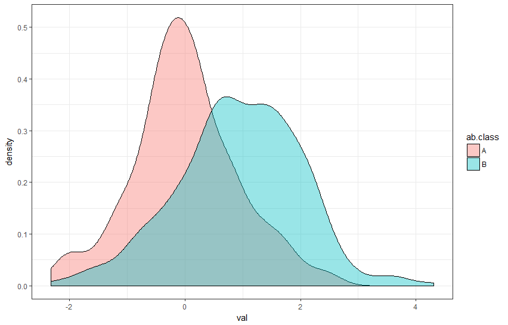

```{r setup, include=FALSE}
library(flexdashboard)
library(leaflet)
library(sf)
```

Labour force
=====================================


Row
-------------------------------------

### Unemployment rate
```{r}
valueBox("X.X%", caption = "Unemployment rate")
```

### Participation rate
```{r}
valueBox("X.X%", caption = "Participation rate")
```

### Employed
```{r}
valueBox("Xk", caption = "Employed aboriginal Victorians")
```

### Unemployed
```{r}
valueBox("Xk", caption = "Unemployed aboriginal Victorians")
```

Row
-------------------------------------

### Employment map w/ popup timeseries line chart


### Multiple bar charts - Avoriginal vs Total Vic metrics {data-width=300}

```{r}

```

Row
-------------------------------------

### Income distribution aboriginal + all Vic


### Anzsco1 occupation horizontal bar chart
chart goes here

### Breakdown pie charts
Male/female, fulltime/part time, etc


Aboriginal firms
=====================================

Row
-------------------------------------
### Number of indegenous firms
```{r}
valueBox("XX", caption = "Indegenous firms in Vic")
```

### Employment
```{r}
valueBox("Xk", caption = "Employees in indegenous firms")
```

### Employed
```{r}
valueBox("Xm", caption = "Total turnover")
```


Row
-------------------------------------

### Map of firm locations
Popups for number of firms, employment and turnover

### Stacked bar chart of num aboriginal firms 
Y = number of firms

X = year

colour = anzsic1


Row {data-height=100}
-------------------------------------
### Notes
[Data source](https://fbe.unimelb.edu.au/cibl/assets/snapshot/RFQ03898-M-and-M-Snapshot-Study.pdf)


Skills and education {data-orientation=columns}
=====================================


Column
-------------------------------------

### Aboriginal skill supply
Census anzsco1 translated to skills with JSA concordance, e.g.

1. Financial analysis (100 Aboriginal Victorians)
2. Serving customers (60 Aboriginal Victorians)
3. Carpentry (50 Aboriginal Victorians)


Column
-------------------------------------
### Highest education distribution bar chart
Census

### Regional breakdown of education levels
either map or bar chart of ASGS remoteness areas with % tertiary edu (incl tafe)


### Comparison with Vic total
probs Bar


Job and study pathways
=====================================


Row
-------------------------------------

### Pathway diagram
Use LSIC to make a sankey diagram over age to show how teens transition into 
school, study, employment or other


Row
-------------------------------------

### 18 year old outcomes
Pie chart of where youth are at when 18. Studying, employed, etc.

### Comparison to rest of Vic
Bar chart


Aboriginal Policy {data-orientation=columns}
=====================================


Column
-------------------------------------

### Budget initiatives
Go though the aboriginal programs in budget paper 3 from recent budgets to get 
total spend by program.

Present here as vertical bar chart with program and  year dimensions 

Column {.tabset data-width=300}
-------------------------------------

### 2023
Rundown of programs in this budget

### 2022
Rundown of programs in this budget

### 2021
Rundown of programs in this budget

### 2020
Rundown of programs in this budget


